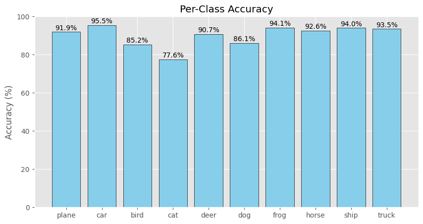

# VGG Implementation on CIFAR-10 with PyTorch

## 📖 项目简介 (Introduction)
本项目是经典论文 **"Very Deep Convolutional Networks for Large-Scale Image Recognition" (VGG)** 的复现。
我使用了 **PyTorch** 搭建了 **VGG-11/13/16/19** 模型，并将 **VGG16** 在 **CIFAR-10** 数据集上进行了完整的训练与测试。

核心工作：
- [x] 手动搭建 VGG 网络结构（含 Batch Normalization）
- [x] 实现数据增强与预处理
- [x] 可视化训练过程（Loss/Accuracy）与混淆矩阵
- [x] 验证集准确率达到 **90.28%** (填入你的最好成绩)

## 🛠️ 环境依赖 (Requirements)
- Python 3.8+
- PyTorch
- Torchvision
- Matplotlib
- Seaborn

安装依赖：
```bash
pip install -r requirements.txt
```

## 实验结果 (Experimental Results)
1. 训练曲线 (Training Curves)

2. 混淆矩阵 (Confusion Matrix)

3. 各个类别的准确率 (Per-Class Accuracy)

4. 预测样本展示 (Predictions)


## 🚀 快速开始 (How to Run)
克隆仓库：
```bash
git clone https://github.com/JLRan-cs/VGG-CIFAR10-PyTorch.git
```
打开 Train_VGG.ipynb 并运行所有单元格。
数据集会自动下载到 data/ 目录。

## 📝 结论 (Conclusion)
通过实验发现，VGG-16 在结合 Batch Normalization 和适当的数据增强（如 RandomCrop）后，在 32x32 分辨率下依然能取得优秀的分类效果，最终 Accuracy 为 90.28%。未来工作可以尝试更深的网络结构或其他正则化方法以进一步提升性能。